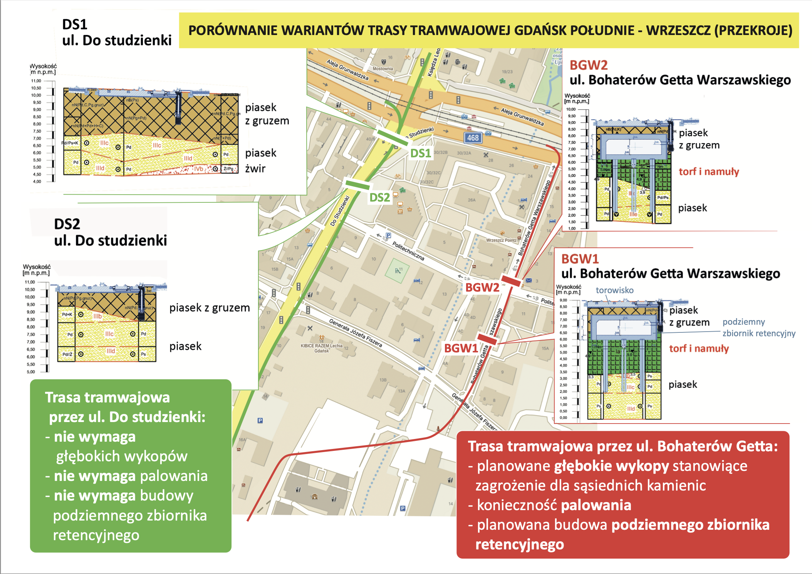

+++
title = 'Wystąpienie podczas absolutoryjnej sesji Rady Miasta Gdańsk'
date = '2024-06-20'
draft = false
tags = ['konferencja prasowa', 'kalendarium']
+++

Zabraliśmy głos podczas absolutoryjnej sesji Rady Miasta Gdańsk. Michał Błaut i Jakub Marchwicki mieli okazję wyrazić sprzeciw przeciwko absurdalnej inwestycji tramwajowej. 

<!--more-->

## Michał Błaut

> Michał skupił się na kontrowersjach wokół inwestycji tramwajowych w Gdańsku, w szczególności budowy trasy przez ul. Klonową do dworca we Wrzeszczu oraz ul. Bohaterów Getta Warszawskiego. Władze Gdańska przeznaczyły 2 mln zł na dokumentację budowlaną 250-metrowego odcinka trasy przez ul. Klonową, jednak projekt ten jest realizowany bez konsultacji społecznych i bez uzyskania decyzji środowiskowej, co budzi obawy o zlekceważenie procedur ochrony środowiska i interesów mieszkańców.
> 
> Podobne problemy dotyczą wyboru trasy tramwajowej Gdańsk Południe – Wrzeszcz. Mimo że ocena oddziaływania na środowisko wskazywała na korzyści z wariantu przez ul. Do Studzienki, władze miasta wybrały bardziej problematyczny wariant przez ul. Bohaterów Getta Warszawskiego. Decyzja ta została skrytykowana przez ekspertów z Politechniki Gdańskiej, którzy wykazali, że analiza użyta do jej podjęcia była niekompletna i nieobiektywna.
> 
> Mieszkańcy czują się ignorowani i oszukiwani, zwłaszcza że dokumentacja budowlana ujawnia problemy wcześniej negowane przez władze, takie jak zagrożenie powodzią w ul. Bohaterów Getta Warszawskiego, co wymaga budowy kosztownego podziemnego zbiornika retencyjnego. Mieszkańcy domagają się większej przejrzystości, uczciwości i uwzględnienia ich interesów w planowaniu inwestycji.

* [Pełna wypowiedź Michała Błauta - PDF](rada_michal-blaut.pdf)
  * [Niebezpieczeństwo wykopu - wersja uproszczona](A3_dolina_bilboard.pdf)
  * [Niebezpieczeństwo wykopu - wersja z dokumentacji](A3_zasieg_wykopu.pdf)
  * [Koreferat Politechniki Gdańskiej](01_Korefert_Raport.pdf)
  * [Koreferat PG - Wariant 1](A3_jamroz01.pdf)
  * [Koreferat PG - Wariant 2](A4_jamroz02.pdf)
  * [Porównanie wariantów BGW - Do Studzienki](A4_porownanie.pdf)

## Jakub Marchwicki

> Jakub "wyraził głębokie zaniepokojenie dotyczącą planowanej inwestycji tramwajowej w Gdańsku". Skrytykował brak transparentności i komunikacji ze strony władz miasta, które jego zdaniem systematycznie ignorowały głosy mieszkańców i ekspertów. Jakub podkreślił, że proces informacyjny był nieskuteczny i niewłaściwie prowadzony, co zmusiło go do wielokrotnych interwencji sądowych w celu uzyskania dostępu do kluczowych dokumentów projektowych.
> 
> W swoim wystąpieniu szczegółowo omówił techniczne aspekty projektu, które według niego stanowią poważne zagrożenie dla bezpieczeństwa okolicznych budynków. Wskazał na liczne nieścisłości i braki w dokumentacji projektowej, które mogą prowadzić do osunięcia się gruntu i uszkodzenia fundamentów kamienic. Zwrócił uwagę, że miasto nie przedstawiło wiarygodnych środków zabezpieczających ani planów rekompensaty za ewentualne szkody, co dodatkowo pogłębia obawy mieszkańców.
> 
> Podsumowując, Jakub zaznaczył, że problem nie dotyczy tylko samej trasy tramwajowej, ale także sposobu zarządzania miastem i podejścia władz do obywateli. Wezwał do bardziej transparentnych i profesjonalnych działań, które uwzględniałyby głosy mieszkańców jako kluczowych interesariuszy inwestycji. Podkreślił, że obecna sytuacja jest wynikiem wieloletnich zaniedbań i braku dialogu, co może mieć poważne konsekwencje dla społeczności lokalnej.

* [Pełna wypowiedź Jakuba Marchwickiego - PDF](rada_jakub-marchwicki.pdf)
