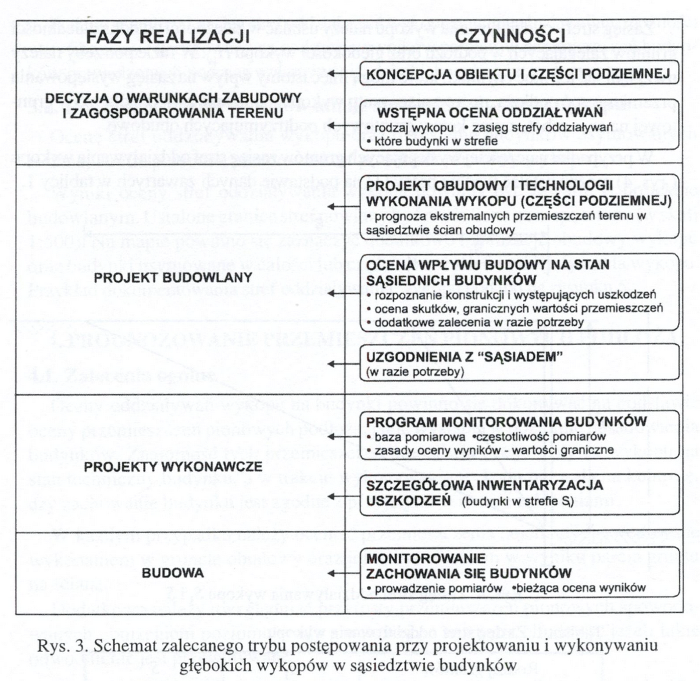

+++
title = 'Konferencja o szczegółach projektu budowlanego'
date = '2024-06-06'
draft = false
tags = ['dokumentacja', 'konferencja prasowa']
+++

Zorganizowaliśmy konferencję prasową o tym jakie ryzyka niesie za sobą forsowany przez miasta sposób posadowienia tramwaju na zbiorniku retencyjnym, czym grozi budowa planowanego przez miasto podziemnego zbiornika, w kontekście tego co nad i co pod ziemią (budynków i sytuacji gruntowej).

<!--more-->

Reakcje prasowe na naszą konferencję:
* trojmiasto.pl: https://www.trojmiasto.pl/wiadomosci/Tramwaj-zniszczy-kamienice-n190043.html
* Zawsze Pomorze: https://www.zawszepomorze.pl/artykul/14074,protest-na-bohaterow-getta-warszawskiego-w-gdansku-chcemy-usiasc-do-rozmow
* Radio Gdańsk: https://radiogdansk.pl/wiadomosci/region/trojmiasto/2024/06/06/czesc-mieszkancow-gdanska-nie-chce-nowej-linii-tramwajowej-protest-trwa-posluchaj/
* TVP3 - Forum Panoramy: https://gdansk.tvp.pl/77934571/06062024 (dyskusja z Dyrektorem DRMG - Krzysztofem Małkowskim)
* TVP3 - felieton filmowy: https://gdansk.tvp.pl/77936495/tramwaj-zwany-niepozadaniem

Po ostatniej konferencji, nasza sprawa zyskała rozgłos i pod koniec maja uzyskaliśmy dostęp do znacznej części dokumentacji projektowej tramwaju od Dyrekcji Rozwoju Miasta Gdańska.
Urząd Miejski nadal odmawia nam wydania niektórych dokumentów, w związku z czym sprawę skierowaliśmy do Wojewódzkiego Sądu Administracyjnego. Została ona zarejestrowana, czekamy na termin rozprawy. Niewydanie nam dokumentacji dowodzi, że “dialog z mieszkańcami” jest tylko frazesem w ustach prezydent Dulkiewicz oraz wiceprezydenta Grzelaka, i że w rzeczywistości, w Gdańsku z władzami można dyskutować jedynie o sprawach które nie kolidują z interesami władz miasta, najlepiej na festynach.

**Miasto ukrywało zagrożenie dla naszych domów**
Zapoznaliśmy się ze znaczną częścią dokumentacji budowlanej, potrzebnej do uzyskania zgody na budowę i napawa nas ona grozą. Zdajemy sobie już sprawę, czemu urzędnicy pani Dukiewicz nie chcieli podzielić się z nami tymi planami. Teraz już nie tylko domyślamy się, ale wiemy, jakie zagrożenie stanowić będzie dla naszych zabytkowych kamienic powstanie trasy tramwajowej przez ul. Bohaterów Getta Warszawskiego. Przedstawiamy Państwu mapę, na której autorzy dokumentacji zaznaczyli strefy zagrożenia uszkodzeniem budynków albo nawet ich zawaleniem, które może nastąpić już na etapie budowy trasy.

(pełna mapa: https://mieszkancybgw.pl/tygodniowka/2024-06-03/zasieg_wykopu.pdf) 
(mapa uproszczona: https://mieszkancybgw.pl/tygodniowka/2024-06-03/zasieg_wykopu-uproszczony.pdf) 

Z czego wynika to zagrożenie? Okazuje się, że wraz z budową torowiska władze miasta zdecydowały się umieścić pod powierzchnią naszej ulicy podziemny zbiornik retencyjny, który ma zastąpić dotychczasowy znacznie węższy kanał ulgi Potoku Królewskiego. Do jego wykonania niezbędne jest z kolei wykonanie głębokich otwartych wykopów w bliskim sąsiedztwie naszych domów. Betonowe komory mają mieć wielkość prawie 6 na 2 metry.
Tu trzeba dodać, że władze miasta starając się o decyzję środowiskową wystąpiły o możliwość przebudowy Kanału Potoku Królewskiego, ale miało się to zamykać w przekroju wewnętrznym 3 na 2 metry. Jest to skandaliczna niezgodność projektu budowlanego, który powinien realizować uzgodnienia zapisane w decyzji środowiskowej. 

W wyniku tej bezprawnej zmiany zbiornik niebezpiecznie zbliża się do naszych domów na tyle, że wykopy potrzebne do przygotowania podziemnych komór zbiornika, bezpośrednio zagrażać zaczynają konstrukcji naszych domów. W jaki sposób?
Sam zbiornik retencyjny, znajdzie się w wykopie otwartym, o głębokości poniżej poziomu wód gruntowych. W takim przypadku w wykopie pozostaje woda, która musi zostać odpompowana. Będzie to miało dwojakie skutki.
* Po pierwsze, z samej analizy geologicznej wynika że podstawowa warstwa gruntów pod naszymi kamienicami to torfy i namuły, czyli resztki roślin, patyki i błoto. Osuszenie tej warstwy spowoduje drastyczne obniżenie ich spoistości i objętości - co z ogromnym prawdopodobieństwem zakońcyć się może zapadnięciem się naszych kamienic.
* Po drugie, jako że proces odpompowywania jest mechaniczny, może prowadzić do powstawania nienaturalnych lejów i zapadlisk, które ze względu na niewielką odległość od budynków - mogą im zagrażają. Jako że grunty, na których posadowione są domy nie spełniają parametrów nośności więc ryzyko ich podmycia jest znacznie większe.

Podejście zaprezentowane przez miasto jest niezgodne z trybem postępowania opisanym w opracowaniach na który powołują się sami autorzy projektu budowlanego _(fragment z opracowania: Walery Kotlicki, Lech Wysokinski, “Ochrona zabudowy w sasiedztwie glebokich wykopów” - Instytut Techniki Budowlanej, Warszawa 2002)_

Obecnie władze miasta są już na kolejnym etapie i dysponują dokumentacją wykonawczą, której również nam nie chcą przekazać, a nie tylko nie podjęły żadnych rozmów z nami, ale wręcz tak długo jak to możliwe utrudniały nam dostęp do informacji.
Bez dokumentacji wykonawczej nie wiemy, jak zabezpieczone będą nasze domy - a widać że jest przed czym je zabezpieczać. Niestety informacji na temat dokumentacji wykonawczej miasto nie chce udostępnić. Termin przygotowania tej części dokumentacji minął 2 maja, a mieszkańcy wciąż nie mogą się zapoznać ze szczegółami.
 
Żądamy informacji **o zabezpieczeniu kamienic na czas planowanej budowy**.
Wpływ zbiornika na środowisko (opisany w rozdziale 7 projektu budowlanego - “Wpływ inwestycji na środowisko”), to zbiór ogólników żywcem przepisanych z Wikipedii, bez jakiegokolwiek odniesienia do obowiązującej decyzji środowiskowej, a wręcz z jej pominięciem.

Przygotowanie takiej inwestycji na etapie projektu budowlanego winno zawierać elementy, takie jak: projekt obudowy i technologii wykonania wykopu, prognoza ekstremalnych przemieszczeń terenu, ocena wpływu na stan sąsiednich budynków, ocena skutków, graniczne wartości przemieszczeń. W przypadku realizacji zagrażającej konstrukcji budynków zalecane są uzgodnienia ze sąsiadami. Co natomiast proponuje miasto? Wyłącznie ogólniki: “Na etapie realizacji zostanie wykonany przez Wykonawcę projekt technologiczny obudowy wykopów (rozdział 5.1.4 Tomu II /3 - budowa i przebudowa odcinków potoku królewskiego)”. Jakiej obudówy, o jakich przekrojach, w jakiej technologi wykonanej - to są pytania na które specjaliści opiekujący się naszymi zabytkowymi kamienicami nie są w stanie otrzymać odpowiedzi.

**Zagrożenie nie ustanie po zakończeniu budowy zbiornika i torowiska**
Zbiornik retencyjny oznacza zabetonowanie ulicy. To są 100-letnie domy stojące na drewnianych palach. Poziom wód w naturalny sposób uległ obniżeniu z 2 do 4 metrów pod poziomem gruntu. Dalsze betonowanie ulicy oznacza odcięcie wschodniej strony ulicy Bohaterów Getta Warszawskiego od naturalnych cieków wodnych, co w dalszej perspektywie może doprowadzić do całkowitego odsłonięcia pali. Niedobór wody spowoduje ich zagrzybienie, zmurszenie i narażenie konstrukcji budynków. To są rzeczy, które można zabezpieczyć, ale nie wiemy nawet, czy takie zabezpieczenia są planowane. Nie chcemy, aby ta część Górnego Wrzeszcza zaczęła się walić, jak ma to miejsce z kościołami czy kamienicami na Starym Mieście. Problemy hydrologiczne są realne, a to, co miasto planuje na Bohaterów Getta w żaden sposób nie rozwiązuje problemów, a wręcz tylko je pogłębia.

Zbiornik retencyjny to też proces napełniania i spuszczania wody, który dodatkowo wpływa na ruchy gruntu. Wpływa w sposób, który w żaden sposób nie był objęty analizą środowiskową. Dynamiczne obciążenia tego rodzaju nigdy bowiem nie były przedmiotem badań. Zatrzymanie tramwaju na światłach na skrzyżowaniu BGW i Grunwaldzkiej to kolejne kilkadziesiąt ton nacisku, kolejne obciążenia dynamiczne niepoddane analizom.

A nie doszliśmy jeszcze do zabezpieczenia kamienic przed wpływem drgań podczas eksploatacji. Nie wiemy nic o planowanych dylatacjach i czy w ogóle będą. Nie zostały wykonane badania odnoszące się do istniejącego taboru tramwajowego oraz istniejącej infrastruktury. Urzędnicy mówią: w Nowym Porcie tramwaj też jeździ blisko starych kamienic. Tamtejsza zabudowa została zbudowana po zbudowaniu linii tramwajowej i była od początku projektowana z uwzględnieniem sąsiedztwa wibracji i hałasu odtramwajowego. Nasze domy stoją na drewnianych palach na terenach słabonośnych i z pewnością żadnemu z projektantów sprzed 120 lat przez myśl nie przeszło puszczenoie w tym miejscu linii tramwajowej. Poza tym ten tramwaj na ulicy Wolności, który według korytarzowych informacji w urzędzie miasta ma zostać zlikwidowany. Czy w naszym przypadku ktoś po prostu cynicznie liczy, że nasze domy samodzielnie się zawalą?

**Chcemy merytorycznej dyskusji ekspertów nad projektem wykonawczym**
Prezydent Grzelak posługuje się kruczkami prawnymi, próbując przepchnąć ogromny zbiornik retencyjny pod przykrywką przebudowy kanału Potoku Królewskiego. Kruczkami prawnymi posługuje się miasto, przepychając decyzję kolanem. Jak również Pomorski Wojewódzki Konserwator Zabytków, wydając decyzję w tydzień po objęciu stanowiska, robiąc to w takim tempie, że zapomniał objąć nadzorem architektonicznym kilka kamienic w ciągu ulicy (szczególnie tych najbardziej narażonych na uszkodzenie konstrukcji podczas prac budowlanych). Nie zaskakuje zatem, że Miasto Gdańsk tak entuzjastycznie pisało o powołaniu nowego konserwatora zabytków, jako najbardziej wyczekiwanej zmianie personalnej nowej władzy. Nie zaskakuje zatem, że Miasto Gdańsk tak niechętnie dzieliło się szczegółami planowanej inwestycji tramwajowej.

Rozumiem, że projekty się zmienia, że żaden plan nie jest w stanie przetrwać zderzenia z rzeczywistością. Tutaj jednak mamy do czynienia z - mówiąc delikatnie - nonszalancją i ryzykowaniem cudzym dobytkiem. Nie zmienia się w tak znaczący sposób projektów, w sytuacji gdy zmiany mogą bezpośrednio zagrażać ludziom i budynkom, mając tak kolosalny wpływ na środowisko. A takim zagrożeniem jest budowa zbiornika retencyjnego, takim zagrożeniem jest niezbadany wpływ na budynki mechanizmu opróżniania i napełniania zbiornika. Nie wspominając o kilkudziesięcio tonowych tramwajach, przejeżdżających 4 metry od kamieniec. 

**Żądamy merytorycznej dyskusji**. Nie może być tak, że o projekcie dowiadujemy się z korytarzowych półsłówek bądź wypowiedzi Michała Tuska w mediach społecznościowych. W dodatku wypowiedzi niespójnych, według których tramwaj będzie jeździł co 100 sekund, co 3 minuty, co 5 minut, co 10 minut. Każda osoba mówi co innego. Jeżeli w kwestiach tak podstawowych, jak planowany takt tramwaju nie potrafimy uzyskać od miasta jednoznacznych informacji, to jak mamy być spokojni o kwestię zabezpieczeń przed zawaleniem naszych domów.

**Oczekujemy spotkania z prezydent Aleksandrą Dulkiewicz**. Oczekujemy pojawienia się pani prezydent na miejscu, bo chyba nie zdaje sobie sprawy z poczynań jej urzędników. Oczekujemy poważnej, rzeczowej rozmowy - a nie stwierdzeń, że komuś robi się przykro z powodu plakatów. Mi robi się przykro, że mój dom jest w strefie zagrożonej zawaleniem. Oczekujemy merytorycznej dyskusji nad szczegółami projektu, konkretów dotyczących zabezpieczenia naszych domów, a nie ogólników i pustych zapewnień, że “wszystko będzie dobrze”. 
