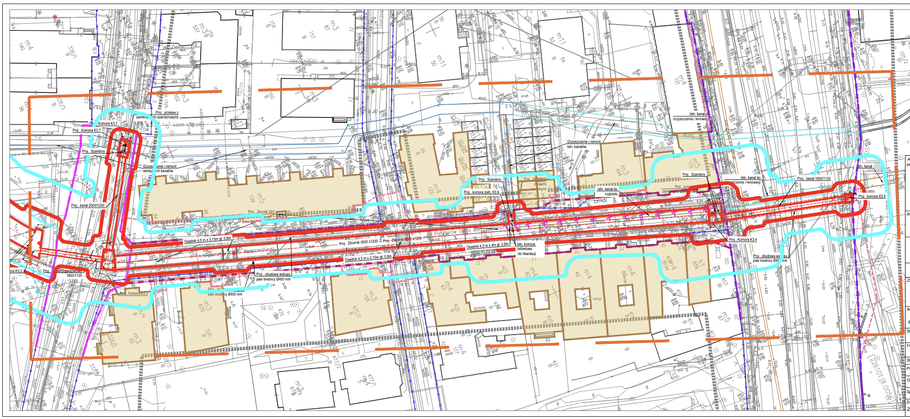
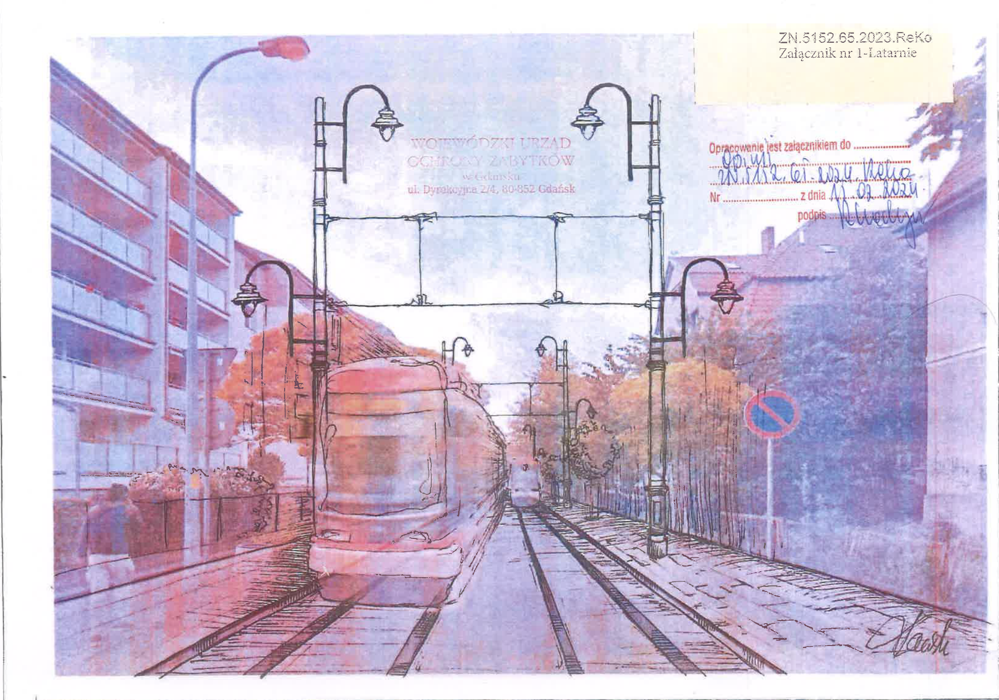

+++
title = 'Tygodniówka tramwajowa #2'
date = '2024-06-03'
draft = false
tags = ['tygodniówka']
+++

O tym co jest w dokumentacji, o wykopie, o trakcji i planach zabrania głosu podczas sesji absolutoryjnej rady miasta.

<!--more-->

Drodzy sąsiedzi i przyjaciele, 

Jesteśmy w trakcie analizy dokumentacji budowlanej którą otrzymaliśmy z Dyrekcji Rozbudowy Miasta Gdańska. Jest tego dużo, ale już wiemy że nie otrzymaliśmy wszystkiego. Wystąpiliśmy o dodatkowe dokumenty, takie jak plany dotyczące przebudowy ulicy Do Studzienki (w ramach tego samego działania inwestycyjnego co tramwaj) bądź projekty wykonawcze naszego odcinka (Fiszera - Grunwaldzka, przez Bohaterów Getta Warszawskiego). 
Projekty wykonawcze są szczególnie istotne, bo tam powinien znaleźć się opis w jaki sposób inwestor (czyli miasto) planuje zabezpieczyć nasze domy przed zawaleniem, zarówno w trakcie budowy jak i podczas późniejszej eksploatacji. A jest przed czym zabezpieczać. Już oficjalnie wiemy, że naszym domom grozi podczas prac budowlanych katastrofa budowlana. Na załączonym elemencie dokumentacji jasno widać potencjalny wpływ wykopu pod ulicą na nasze kamienice. To także dowód na to, że na poprzednich etapach uzgodnień byliśmy oszukiwani i władze oraz firmy działające na ich zlecenie ukrywały przed nami realne ryzyko jakie niesie ta inwestycja

Pobierz pełen PDF: https://mieszkancybgw.pl/tygodniowka/2024-06-03/zasieg_wykopu.pdf

Podczas dotychczasowych rozmów z miastem byliśmy oszukiwani także w innych kwestiach. Zwodzono nas, że po naszej ulicy pojadą tramwaje akumulatorowe i nie trzeba będzie zawieszać trakcji elektrycznej. Trakcja oczywiście wbrew obietnicom została zaplanowana - jak na zdjęciu poniżej.

Pobierz cały PDF: https://mieszkancybgw.pl/tygodniowka/2024-06-03/wizualizacja_trakcja.pdf

Właśnie na temat tych zmian w projekcie, oraz wpływu jaki będą one miały na nasze zabytkowe domy, planujemy kolejną konferencję prasową w tym tygodniu. Poinformuję o niej osobnym mailem, jak już potwierdzimy termin.
Co do aktywnych działań, złożyliśmy zgłoszenia aby zabrać głos podczas absolutoryjnej sesji rady miasta (zgłoszony został Michał i ja - będziemy mieli 10 minut na sprawy tramwajowe). Sesja odbędzie się 20 czerwca i dzięki Waszym podpisom, jako pierwszy zgłosiliśmy się do udziału w debacie. Nasze zgłoszenie zostało już zarejestrowane. 

Chcemy zaprosić Was na ogólne spotkanie z prezentacjami dotyczącymi szczegółów projektu. Uważamy że jest ono konieczne, bo dalsze działania wymagać będą często działania dużą grupą, będziemy musieli pokazać że jest nas wielu/wiele i że jesteśmy zdeterminowani… nadal zdeterminowani, mimo że chory pomysł tramwaju zatruwa nam życie od 8 lat.

W tym momencie może warto zastanowić się , co nasze działania dały, dają lub dadzą w przyszłości?
W założeniu władz miasta budowa tramwaju miała być szybką inwestycją przeprowadzoną  przy biernej postawie nieświadomych mieszkańców. Nie było na to szans od początku - bardzo źle trafili. Działania władz spotkały się z protestami i silną merytoryczną odpowiedzią ze strony świetnie zorganizowanych i odpowiedzialnych mieszkańców. Starano się nas zawstydzić, zahukać i włożyć w nasze usta argumenty, których nie stosowaliśmy. To też się nie powiodło, choć korzystając z przewagi w dostępie do mediów, miasto próbowało przyprawiać zaczęto nam gębę oszołomów hamujących rozwój miasta. Mimo tego udało nam się zmusić władze miasta do przeprowadzenia części niezbędnych badań i do wycofania się z niektórych, szczególnie niekorzystnych dla nas rozwiązań. Nie dopuściliśmy, żeby na naszej ulicy wprowadzić strefę, w której nie obowiązywałyby normy hałasu i drgań.

Teraz powoli spadają maski i to co było ukrywane przez urzędników, wychodzi na jaw w dokumentacji którą zdobyliśmy. Okazuje się że to my mieliśmy rację i co najważniejsze okazuje się to zanim wkopano pierwszą łopatę. 
Czy to coś zmienia? Tak, w zasadzie wszystko. Nadal możemy wstrzymać inwestycje w takim kształcie. Dostrzegamy dużą ilość istotnych nieprawidłowości. 
A jeśli nie uda się powstrzymać trasy tramwajowej? To i tak warto walczyć o swoje prawa i racje. Urzędnicy, prezydenci czy opłacani przez nich projektanci nie mogą już udawać, że o niczym nie wiedzieli albo że czegoś się nie spodziewali. Dzięki temu nie tylko my będziemy ryzykować, że nasze domy się zaczną chwiać, ale i oni muszą się zacząć obawiać że w razie katastrofy spadnie na nich odpowiedzialność, bo działali z pełną świadomością. To wszystko jest przez nas dokumentowane i nagłaśniane. Nie będziemy siedzieć cicho i nie zapomnimy.

Pamiętajmy, sprawa tramwajowa to nasza wspólna sprawa. Przygotowanie wymaga wiele pracy, wielu osób. A tych osób jest zawsze za mało,wszyscy mają pracę, dom i dla nikogo nie jest to pełnoetatowe zajęcie. Z kolei mamy przeciwko sobie osoby, które zawodowo zajmują się tematami inwestycyjnymi, my robimy to w wolnym czasie. 
Właśnie dlatego potrzebne są każde ręce do pomocy. Mamy dużo dokumentacji do przeanalizowania, dużo telefonów do wykonania, dużo pism do napisania, i jeszcze więcej ulotek do rozniesienia. 

Najbardziej potrzebne jest, doświadczenie w komunikacji w social media, w redagowaniu tekstów na potrzeby strony internetowej, znajomość inżynierii środowiskowej, geodezji, hydrologii, wydatkowaniu środków unijnych, specustawie drogowej, dostępie do danych publicznych i środowiskowych. Ale pomóc może każdy, nie tylko specjalista. Potrzebujemy frekwencji na demonstracjach i spotkaniach władzami,  komentowania w internecie, a nawet po prostu rozmów z rodziną i ze znajomymi o naszym problemie i przekonywania ich do naszych racji. To dzięki temu możemy dużo zdziałać.
